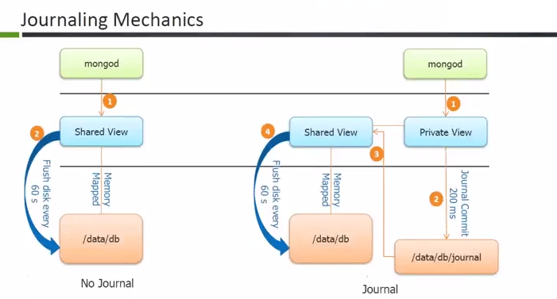

## journaling
> With journaling, WiredTiger creates one journal record for each client initiated write operation. The journal record includes any internal write operations caused by the initial write. For example, an update to a document in a collection may result in modifications to the indexes; WiredTiger creates a single journal record that includes both the update operation and its associated index modifications.

> MongoDB configures WiredTiger to use in-memory buffering for storing the journal records. Threads coordinate to allocate and copy into their portion of the buffer. All journal records up to 128 kB are buffered.

